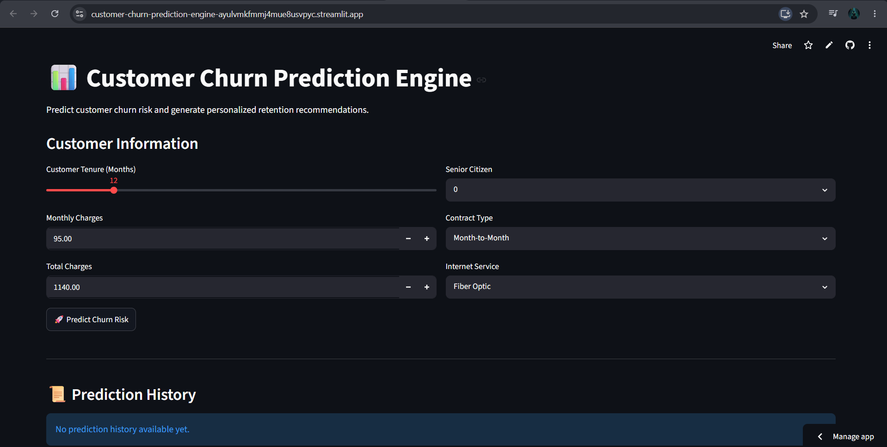
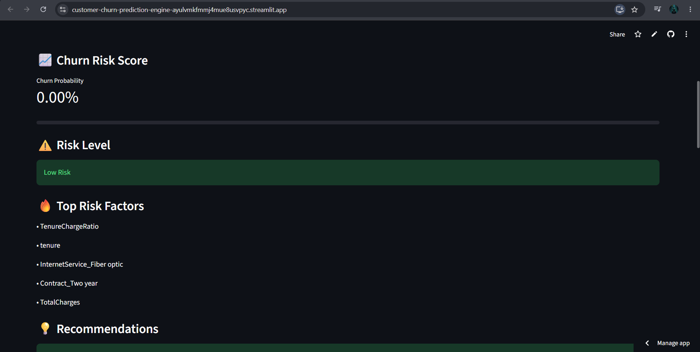
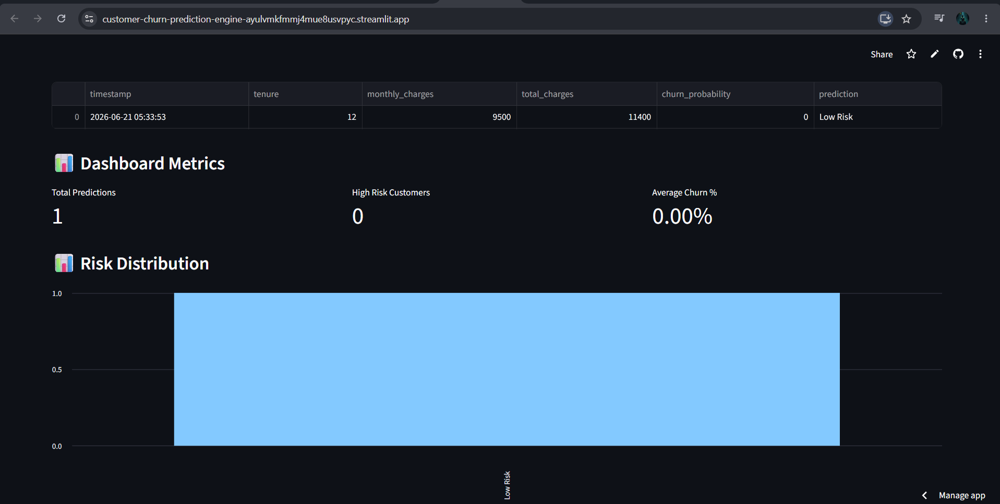

# 📊 Customer Churn Prediction & Retention Recommendation Engine

> End-to-End Machine Learning Solution for Customer Churn Prediction, Retention Recommendations, Explainable Insights, and Analytics Dashboard


---

## 🚀 Live Project

### API Endpoint

https://customer-churn-api-cjiy.onrender.com

### API Documentation

https://customer-churn-api-cjiy.onrender.com/docs

### Source Code

https://github.com/preethi-beri/customer-churn-prediction-engine

---

## 🎯 Problem Statement

Customer churn is a major challenge for subscription-based businesses. Losing existing customers directly impacts revenue, customer lifetime value, and business growth.

This project uses Machine Learning to identify customers who are likely to churn and provides personalized retention recommendations to help businesses take proactive actions.

---

## ✨ Key Features

* 🔍 Real-time Customer Churn Prediction
* ⚠️ Automatic Risk Classification
* 💡 Retention Recommendation Engine
* 🔥 Explainable Risk Factors
* 📈 Interactive Analytics Dashboard
* 📜 Prediction History Tracking
* 📥 CSV Export Functionality
* 🌐 FastAPI REST API Deployment
* ☁️ Cloud Hosted on Render

---

## 📸 Application Screenshots

### Dashboard Overview



### Prediction Results



### Analytics Dashboard


---

## 📈 Project Highlights

* Built an end-to-end Machine Learning pipeline from data preprocessing to cloud deployment.
* Developed REST APIs using FastAPI for real-time customer churn prediction.
* Designed an interactive Streamlit dashboard for business users and analysts.
* Implemented a recommendation engine for customer retention strategies.
* Added explainable insights to identify key churn-driving factors.
* Achieved strong predictive performance with high ROC-AUC score.
* Enabled analytics reporting and prediction history tracking.

---

## 🏗️ System Architecture

```text
Customer Data
      │
      ▼
Feature Engineering
      │
      ▼
Machine Learning Model
      │
      ▼
FastAPI Backend
      │
      ▼
Streamlit Dashboard
      │
      ▼
Predictions + Recommendations + Analytics
```

---

## 🧠 Skills Demonstrated

* Machine Learning
* Predictive Analytics
* Feature Engineering
* Data Cleaning & Preprocessing
* Model Evaluation
* Data Visualization
* FastAPI Development
* REST API Design
* Streamlit Development
* Cloud Deployment
* Git & GitHub

---

## 🛠️ Technology Stack

### Programming Language

* Python

### Data Processing

* Pandas
* NumPy

### Machine Learning

* Scikit-Learn
* Logistic Regression
* Random Forest
* XGBoost
* SMOTE

### Backend

* FastAPI
* Uvicorn

### Frontend

* Streamlit

### Deployment

* Render

### Version Control

* Git
* GitHub

---

## 📂 Project Structure

```text
customer-churn-prediction-engine
│
├── frontend/
│   └── app.py
│
├── src/
│   ├── api.py
│   ├── train.py
│   ├── preprocessing.py
│   ├── recommender.py
│   └── explainer.py
│
├── models/
│   ├── churn_model.pkl
│   ├── scaler.pkl
│   └── feature_names.json
│
├── data/
│   ├── raw/
│   ├── processed/
│   └── predictions/
│
├── screenshots/
│   ├── dashboard.png
│   ├── prediction.png
│   └── analytics.png
│
├── requirements.txt
├── README.md
└── .gitignore
```

---

## 📊 Model Performance

| Metric    | Score  |
| --------- | ------ |
| Accuracy  | 79.32% |
| Precision | 63.43% |
| Recall    | 52.41% |
| F1 Score  | 57.39% |
| ROC-AUC   | 83.75% |

---

## 🎯 Business Impact

This solution helps organizations:

* Identify customers likely to churn
* Improve retention strategies
* Reduce revenue loss
* Increase customer lifetime value
* Support data-driven decision making
* Enhance customer engagement

---

## 🔮 Future Enhancements

* SHAP Explainable AI Visualizations
* Customer Segmentation
* Automated PDF Reports
* Docker Deployment
* Cloud Database Integration
* User Authentication
* Real-Time Monitoring
* Automated Model Retraining

---

## 🚀 Getting Started

### Clone Repository

```bash
git clone https://github.com/preethi-beri/customer-churn-prediction-engine.git
```

### Install Dependencies

```bash
pip install -r requirements.txt
```

### Run FastAPI Backend

```bash
uvicorn src.api:app --reload
```

### Run Streamlit Dashboard

```bash
streamlit run frontend/app.py
```

---

## 👩‍💻 Author

### Preethi Beri

B.Tech – Computer Science & Engineering (Data Science)

GitHub: https://github.com/preethi-beri

LinkedIn: https://www.linkedin.com/in/preethi-beri/

---

## ⭐ Support

If you found this project useful, consider giving it a ⭐ on GitHub.

---

### Resume Project Summary

Developed an end-to-end Customer Churn Prediction & Retention Recommendation Engine using Python, Scikit-Learn, FastAPI, and Streamlit. Built and deployed a REST API, implemented predictive analytics, generated personalized retention recommendations, and created an interactive analytics dashboard for customer risk monitoring.
